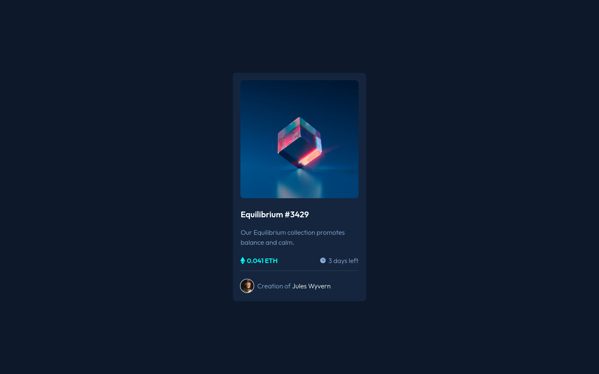

# Frontend Mentor - NFT Preview Card component solution

This is a solution to the [NFT Preview Card component challenge on Frontend Mentor](https://www.frontendmentor.io/challenges/nft-preview-card-component-SbdUL_w0U). Frontend Mentor challenges help you improve your coding skills by building realistic projects.

## Table of contents

- [Overview](#overview)
  - [The challenge](#the-challenge)
  - [Screenshot](#screenshot)
  - [Links](#links)
- [My process](#my-process)
  - [Built with](#built-with)
- [Author](#author)

## Overview

### The challenge

Users should be able to:

- View the optimal layout depending on their device's screen size
- See hover states for interactive elements

### Screenshot

### Links

- Repository: [Github](https://github.com/johnv2309/nft-preview-card)
- Solution: [Frontend Mentor](https://your-solution-url.com)
- Live Site: [Netlify](https://johnv2309-nft-preview-card.netlify.app/)

## My process

### Built with

- Semantic HTML5 markup
- CSS custom properties
- Flexbox
- Mobile-first workflow

## Author

- Github - [@johnv2309](https://www.your-site.com)
- Frontend Mentor - [@johnv2309](https://www.frontendmentor.io/profile/johnv2309)
